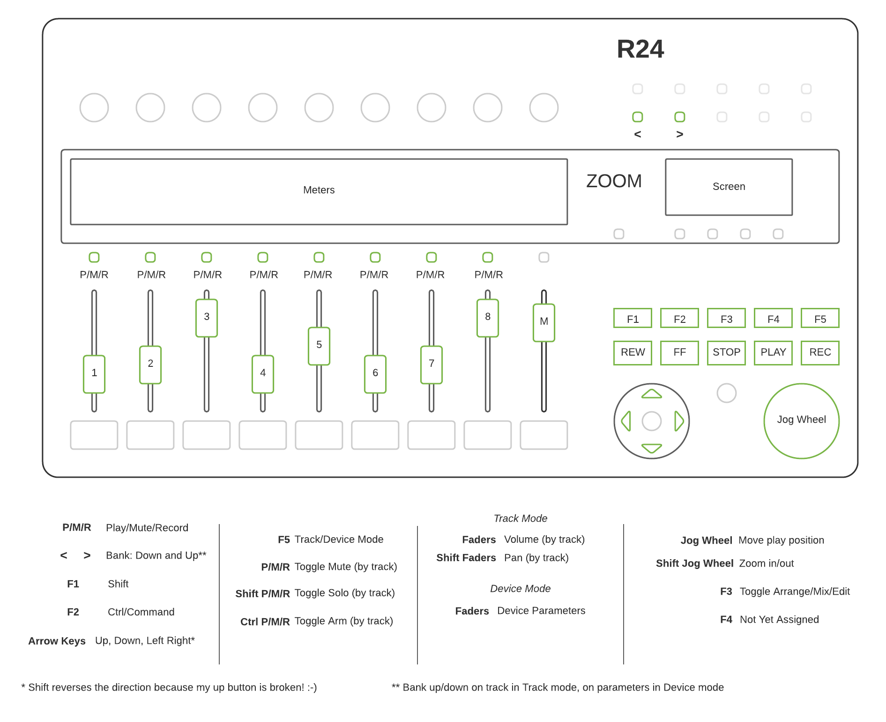

# Zoom R12/R24 Controller Extension for Bitwig Studio

## What is it?
This code allows you to use your Zoom R12/24 (R24) as a control surface for Bitwig Studio (BWS)

## How do I install it?
This is _not_ a JavaScript extension - the steps to install are more complicated that just copying the files. 
To install this extension, you need to compile it and copy the output to the _Extensions_ directory of your BWS.
I've tried to make this as easy as possible. There just a few steps, but this _does_ assume that you have a 
Java Development Kit (JDK) installed that is version 12 or higher (this is required by the Java API provided by Bitwig).
I strongly recommend you use [sdkman](https://sdkman.io/install) to do this, if you don't already have a JDK installed.

Once installed, do the following:
1. Clone this repository to a directory on the same computer as your BWS.
2. In the base/root directory of the cloned repository, add a file called bitwig.properties. 
Use the provided _bitwig.properties.example_ file, and update the single property inside to point at your BWS extensions directory 
   (*not* the controller scripts directory - this is just for JavaScript)
   The provided example assumes a Linux installation so you may have to change it to point at your _Documents_ folder if 
   installing on Windows - see the Bitwig documentation for details.
3. From this base/root directory, run ```./mvnw -Plocal-deploy clean install``` on Linux/MacOS or ```mvnw -Plocal-deploy clean install``` on Windows. 
   This command will first download the Maven build tool, and then invoke it to build the project and copy it to the 
   directory you configured in the properties file in step 2.
   
That's it - your extension should now be installed.

## How do I use it?
I'm going to assume you know how to use Bitwig to connect a controller. 
Just note that this controller will be found under the Zoom manufacturer, and is called _Zoom R24 Controller_.

The following diagram explains how the Zoom's faders, buttons and wheel can be used in BWS.



## Important information
* This extension requires API version 12 and upwards which corresponds to BWS 3.2.5 or later.
* This code is licensed under Apache 2.0, which allows it to be used for free but also potentially to be used in 
  commercially licensed software.

## Nerdy details
This is a Java-based extension (as opposed to JavaScript), which is to say it runs on the Java Virtual Machine, 
which permits a number of languages, including the one I have chosen to use in this instance - [Kotlin](https://kotlinlang.org/).
Kotlin is a "better Java", facilitating more concise and reliable programming. 
This code makes use of a number of Kotlin-specific programming approaches, such as extension functions,
data classes, sealed classes, null-safety, and pattern matching. 
The code trys to stick to idiomatic Kotlin concepts like using expressions whereever possible. 


The design of the extension is based on the [Elm Architecture](https://guide.elm-lang.org/architecture/), a pattern 
introduced by the Elm language, and widely copied by other web UI frameworks.
The basic concept is that of a state machine: The extension models a state which represents a combined state of the 
controller (the R24) and the application (BWS). This state can only be updated by means of input events coming from either 
the controller or the application. 
Any input event can result in a change to the model, or an output event being emitted, or both. 
The way in which input events are interpreted depends on the current state.  
Emitted events are converted into calls to the BWS API. 

A good example of state is the 'shift' state. For as long as the F1 button is held down,

Only one event can be processed at a time. It is processed to completion before the next event is considered.

The state itself is an immutable object - it is not changed but atomically replaced with an updated version when state 
change is required. 

If you want to adapt this code for your own needs (or create a Pull Request on this repo) 
see [this useful guide](https://github.com/outterback/bitwig-controller-tutorial) for tips on how to develop Java-based
extensions. I recommend using IntelliJ as an IDE.

## Feedback welcome

If you have suggestions for improvements either to the code or the functionality, please raise an issue. 
Even better, create a Pull Request with suggested fixes.
